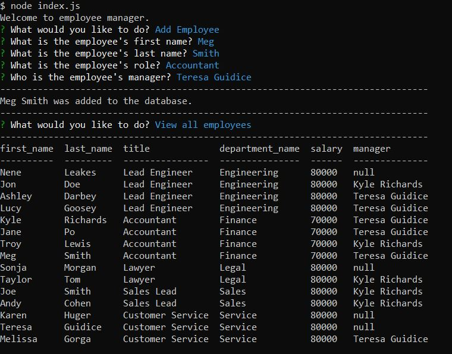

# Employee Management System

## Description

I developed a command-line application to manage a company's employee database. This application was created use Node.js, Inquirer and MySQL. I built this content management system for non-developers to view and interact with their employees' information in a secure database. This application makes it easy for users to add employees, roles, departments, update employee information and view employee & company information.

## Installation

To install please run the following commands:

        npm i
        node index.js

## Usage

Example photo of application:

Link to video demonstrating the application:

https://drive.google.com/file/d/12q4tS4HF7gAACxRp49tVbluL4sSwF0Px/view?usp=sharing

## Questions 

Please find me on GitHub [nicolepingar](https://github.com/nicolepingar) or email me at nicolepingar@gmail.com.